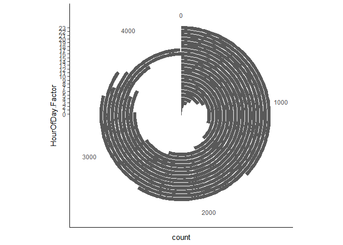

title: "Scooter analysis"
author: "Masha"
date: "2/15/2020"
output: 
   md_document:
    variant: markdown_github


# Scooter-data-analysis-and-vizualization

``` r
#Loading two packages needed for viz
library(dplyr)
```

    ## 
    ## Attaching package: 'dplyr'

    ## The following objects are masked from 'package:stats':
    ## 
    ##     filter, lag

    ## The following objects are masked from 'package:base':
    ## 
    ##     intersect, setdiff, setequal, union

``` r
library(ggplot2)
```

    ## Warning: package 'ggplot2' was built under R version 3.6.2

``` r
Scooters <- read.csv("scooters.csv")
```

``` r
#To look at the data, use View
View(Scooters)
```

``` r
(Scooters
  %>% filter(as.Date(StartDate) >= as.Date("2019-07-01"))
  %>% mutate(DayOfWeek.Factor = as.factor(DayOfWeek))
  %>% group_by(DayOfWeek.Factor)
  %>% summarize(count=n())
  %>% mutate(DayOfWeek.Name = as.factor(case_when(DayOfWeek.Factor=="1" ~ "Sunday",
                                                  DayOfWeek.Factor=="2" ~ "Monday",
                                                  DayOfWeek.Factor=="3" ~ "Tuesday",
                                                  DayOfWeek.Factor=="4" ~ "Wednesday",
                                                  DayOfWeek.Factor=="5" ~ "Thursday",
                                                  DayOfWeek.Factor=="6" ~ "Friday",
                                                  DayOfWeek.Factor=="7" ~ "Saturday"
  )
  )
  )
  %>%add_row(DayOfWeek.Factor="8",count=0,DayOfWeek.Name="Blank") # adding an empty row
  %>%mutate(DayOfWeek.Factor.Order = factor(DayOfWeek.Factor,levels=c("2","3","4","5","6","8","7","1"))) #Pputting the weekends close together
  %>%arrange(DayOfWeek.Factor.Order)
  -> Scooter_Summary  
)
```

    ## # A tibble: 8 x 4
    ##   DayOfWeek.Factor count DayOfWeek.Name DayOfWeek.Factor.Order
    ##   <fct>            <dbl> <fct>          <fct>                 
    ## 1 2                 6031 Monday         2                     
    ## 2 3                 6550 Tuesday        3                     
    ## 3 4                 7433 Wednesday      4                     
    ## 4 5                 7425 Thursday       5                     
    ## 5 6                 8888 Friday         6                     
    ## 6 8                    0 Blank          8                     
    ## 7 7                11113 Saturday       7                     
    ## 8 1                 7412 Sunday         1

``` r
#the graph code
ggplot(Scooter_Summary, aes(x=DayOfWeek.Factor.Order,y=count)) +
  geom_bar(stat="identity") + 
  #scale_x_discrete(limits=c("7","1","2","3","4","5","6"),labels=c("7"="Saturday", "1" = "Sunday", "2" = "Monday", "3" = "Tuesday", "4"="Wednesday","5"="Thursday","6"="Friday"))
  scale_x_discrete(name="",labels=c("2"="Monday","3"="Tuesday","4"="Wednesday","5"="Thursday","6"="Friday","8"="","7"="Saturday","1"="Sunday")) + 
  theme_classic() + 
  theme(axis.title.y=element_blank(),
        axis.line.y=element_blank(),
        axis.text.y=element_blank(),
        axis.ticks.y=element_blank()
  ) -> BasePlot #the graph infor saved to this object


BasePlot
```


``` r
(
  Scooter_Summary 
  #declaring the weekends
  %>% mutate(Weekend=as.factor(case_when(DayOfWeek.Name=="Saturday" ~ "Yes",
                                         DayOfWeek.Name=="Sunday" ~ "Yes",
                                         DayOfWeek.Name=="Blank" ~ NA_character_,
                                         TRUE~"No")
  )
  )
  %>% filter(!is.na(Weekend))
  -> Scooter_Summary_Weekend
)
```

    ## # A tibble: 7 x 5
    ##   DayOfWeek.Factor count DayOfWeek.Name DayOfWeek.Factor.Order Weekend
    ##   <fct>            <dbl> <fct>          <fct>                  <fct>  
    ## 1 2                 6031 Monday         2                      No     
    ## 2 3                 6550 Tuesday        3                      No     
    ## 3 4                 7433 Wednesday      4                      No     
    ## 4 5                 7425 Thursday       5                      No     
    ## 5 6                 8888 Friday         6                      No     
    ## 6 7                11113 Saturday       7                      Yes    
    ## 7 1                 7412 Sunday         1                      Yes

``` r
(
  Scooter_Summary_Weekend
  %>% group_by(Weekend)
  %>% summarize(Avg = mean(count) )
  %>% mutate(xmin=c(0.5,6.5),xmax=c(5.5,8.5))
  -> Scooter_Summary_Weekend_Avgs
)
```

    ## # A tibble: 2 x 4
    ##   Weekend   Avg  xmin  xmax
    ##   <fct>   <dbl> <dbl> <dbl>
    ## 1 No      7265.   0.5   5.5
    ## 2 Yes     9262.   6.5   8.5

``` r
text.xvalue <- 1
text.yvalue <- 10000
text.label<-c("Usage is about 30% higher on weekends")
```

``` r
BasePlot + 
  geom_bar(Scooter_Summary_Weekend,stat="identity",mapping=aes(fill=Weekend)) +
  geom_segment(Scooter_Summary_Weekend_Avgs,mapping=aes(x=xmin,xend=xmax,y=Avg,yend=Avg)) + 
  #geom_text(aes(x=text.xvalue,y=text.yvalue),hjust=0,label=text.label) + 
  theme(legend.position="none")
```


``` r
(Scooters
 %>% filter(as.Date(StartDate) >= as.Date("2019-07-01"))
 %>% mutate(HourOfDay.Factor = as.factor(HourNum))
 %>% group_by(HourOfDay.Factor)
 %>% summarize(count=n())
 %>% filter(HourOfDay.Factor != "24")
 -> Scooter_Hour_Summary  
)
```

    ## # A tibble: 24 x 2
    ##    HourOfDay.Factor count
    ##    <fct>            <int>
    ##  1 0                  133
    ##  2 1                  105
    ##  3 2                  146
    ##  4 3                  299
    ##  5 4                  412
    ##  6 5                  676
    ##  7 6                  787
    ##  8 7                 1291
    ##  9 8                 1663
    ## 10 9                 1934
    ## # ... with 14 more rows

``` r
ggplot(Scooter_Hour_Summary,mapping=aes(x=HourOfDay.Factor,y=count)) +
  geom_bar(stat="identity") +
  coord_polar(theta="x", start=0) 
```


``` r
PlotAM <- ggplot(filter(Scooter_Hour_Summary, as.numeric(HourOfDay.Factor)<13),mapping=aes(x=HourOfDay.Factor,y=rep(1,12), fill=count)) +
  geom_bar(stat="identity")
```

``` r
PlotPM <- ggplot(filter(Scooter_Hour_Summary, as.numeric(HourOfDay.Factor)>12),mapping=aes(x=HourOfDay.Factor,y=rep(1,12),fill=count)) +
  geom_bar(stat="identity") +
  coord_polar(theta="x", start=0) +
  theme_void()
```

``` r
library(patchwork)
```

    ## Warning: package 'patchwork' was built under R version 3.6.2

``` r
PlotAM + PlotPM + plot_layout(ncol = 2)
```


``` r
ggplot(Scooter_Hour_Summary,mapping=aes(x=HourOfDay.Factor,y=rep(1,24),fill=count)) +
  geom_bar(stat="identity") +
  theme_void()
```


``` r
ggplot(Scooter_Hour_Summary,mapping=aes(x=HourOfDay.Factor,y=count)) +
  geom_bar(stat="identity") + 
  coord_polar(theta="y") + 
  theme_classic()
```



``` r
(Scooter_Hour_Summary
  %>% mutate(GrandTotal=sum(count))
  %>% mutate(Percent = count / GrandTotal)
  %>% mutate(Total = cumsum(count))
  %>% mutate(PercentTotal = cumsum(Percent))
  -> Scooter_Hour_Summary_Percentages  
)
```

    ## # A tibble: 24 x 6
    ##    HourOfDay.Factor count GrandTotal Percent Total PercentTotal
    ##    <fct>            <int>      <int>   <dbl> <int>        <dbl>
    ##  1 0                  133      54718 0.00243   133      0.00243
    ##  2 1                  105      54718 0.00192   238      0.00435
    ##  3 2                  146      54718 0.00267   384      0.00702
    ##  4 3                  299      54718 0.00546   683      0.0125 
    ##  5 4                  412      54718 0.00753  1095      0.0200 
    ##  6 5                  676      54718 0.0124   1771      0.0324 
    ##  7 6                  787      54718 0.0144   2558      0.0467 
    ##  8 7                 1291      54718 0.0236   3849      0.0703 
    ##  9 8                 1663      54718 0.0304   5512      0.101  
    ## 10 9                 1934      54718 0.0353   7446      0.136  
    ## # ... with 14 more rows

``` r
ggplot(Scooter_Hour_Summary_Percentages, mapping=aes(x="",y=count,fill=count)) +
  geom_bar(stat="identity") +
  geom_text(aes(x="",y=((Total+c(0,head(Total,n=-1)))/2),label=HourOfDay.Factor)) + 
  coord_polar(theta="y") + 
  scale_fill_gradient(low="blue", high="red")+
  theme_void() 
```


``` r
ggplot(Scooter_Hour_Summary_Percentages, mapping=aes(x="",y=Percent,fill=Percent)) +
  geom_bar(stat="identity") +
  geom_text(aes(x="",y=((PercentTotal+c(0,head(PercentTotal,n=-1)))/2),label=HourOfDay.Factor)) + 
  #coord_polar(theta="y") + 
  coord_flip()+
  scale_fill_gradient(low="forestgreen", high="red")+
  theme_void() 
```


